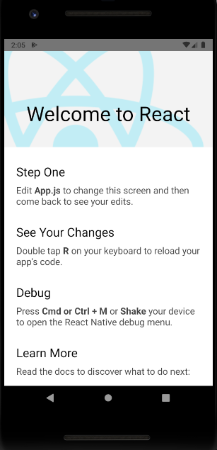
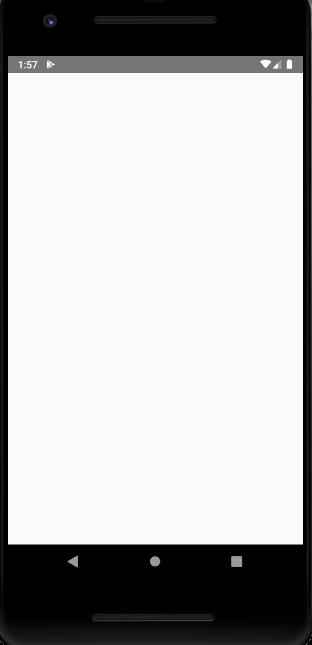

# Slalom's React-Native Dojo!
React-native skeleton code for the slalom dojo. Idea discussed during sync-up: shopping list, with shopping cart for React Native Dojo

## TODO-List

1. Build skeleton project - (Abdeali)
2. Create README with TODO-List - (Abdeali)
3. Create dojo project description in README
4. Create list of steps to begin using React-Native on different OS for each device OS OR link React-Native getting started doc
5. Take screenshots of the various screens reached during installation
6. Make pull request for each of the feature implementations for the dojo.
7. Detail the steps needed to reach the content in each pull request.
8. Outline bonus challenge task.
9. Provide additional learning resources.

## Project Description

## Installation of the Dojo Project

Note: this should only include how to get this repo and and make it work on a simulator or device. For getting started with React-Native, link to the React-Native docs https://facebook.github.io/react-native/docs/getting-started

Running an application is different depending on if you use a physical device, or a virtual one. The pre-requisites for using a virtual device are having either XCode or Android Studio installed if you are using MacOS, or Android Studio if you are using Windows. Virtualization needs to be enabled on your device if you want to use a simulator on your computer.

If you are planning on using a real device to debug your React Native application, usb debugging must be enabled on your device (https://support.brightcove.com/debugging-mobile-devices) **Must verify that the ios portion of the linked doc works**. You will also need a charging cable to connect your device to the computer you are working from.

You will also need an IDE to edit your code in. VSCode is the recommended IDE for this dojo :) 

#### Exercises to Complete

###### Exercise 1: Setup the Project

1. Start by downloading all of the necessary programs for running React Native on your operating system. For this Dojo, we will be using Yarn as our package manager, which you can install here: https://yarnpkg.com/en/docs/install

2. Once you have successfully installed all of the neccessary programs make sure you can generate and run a React Native application.

3. Remove the default code provided with the initial code generation.

Result: You should end up having a blank screen on the device, with no errors.

###### Exercise 2: Setup React Navigation? (Not sure if we are going to use react navigation for this dojo)

###### Exercise 3: Make a Store

###### Exercise 4: Add Logic to the Store

###### Exercise 5: Style the Store

###### Exercise 6: 
