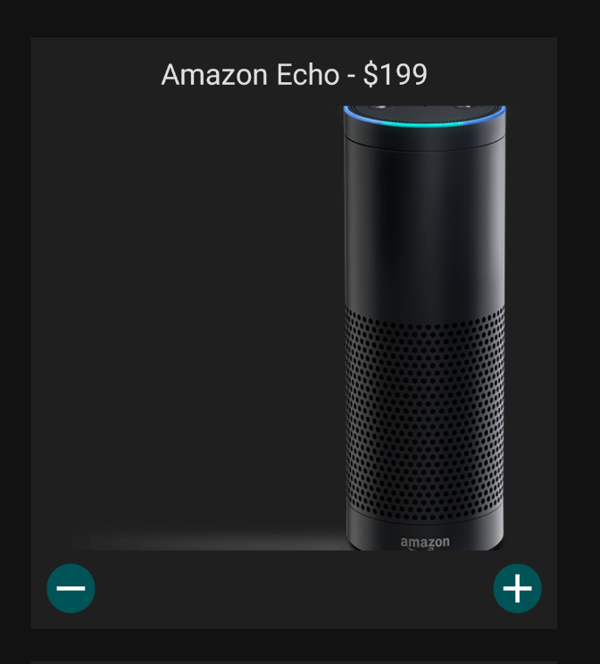

  

# Slalom's React-Native Dojo!

  

## TODO-List

  

5. Take screenshots of the various screens reached during installation

6. Make pull request for each of the feature implementations for the dojo.

8. Outline bonus challenge task.

9. Provide additional learning resources.

  

## Project Description

  

For this dojo, we will be completing the features of a simple shopping cart application, built with React Native and Redux. The goal of the dojo is to get people more comfortable with working with mobile and React Native, Redux is simply there to make managing states easier. One of the exercises will require writing the logic of a Redux reducer, however the goal will not be to use redux best practices, but instead just manipulate the state to make to do what you want.

  

This dojo is intended for those who have a basic understanding of React or greater. However, the dojo supporters will do their best to help those using React/React-Native for the first time.

  

## Installation of the Dojo Project

  

Note: The installation steps are different depending on the laptop OS and the phone OS, so you will need to follow the steps in the getting started docs. Please also install yarn as that will be the package manager of choice for this dojo.

https://yarnpkg.com/en/docs/install

https://reactnative.dev/docs/environment-setup

  

Running an application is different depending on if you use a physical device, or a virtual one. The pre-requisites for using a virtual device are having either XCode or Android Studio installed if you are using MacOS, or Android Studio if you are using Windows. Virtualization needs to be enabled on your computer if you want to use a simulator.

  

If you are planning on using a real device to debug your React Native application, usb debugging must be enabled on your device (https://support.brightcove.com/debugging-mobile-devices). You will also need a charging cable to connect your device to the computer you are working from.

  

You will also need an IDE to edit your code in. VSCode is the recommended IDE for this dojo :)

  

#### Exercises to Complete

  

###### Exercise 1: Setup the Project

  

1. Start by downloading all of the necessary programs for running React Native on your operating system. For this Dojo, we will be using Yarn as our package manager, which you can install here: https://yarnpkg.com/en/docs/install

  

Once you have installed the package manager run:

  

` yarn install`

  

For MacOS you may need to also do this:

  

`cd ios && pod install && cd ..`

  

2. Once you have successfully installed all of the neccessary programs make sure you can run the dojo application. To run the project you can use the command

  

For Android:

  

`
npx react-native run-android
`

  

For iOS:how

  

`
npx react-native run-ios
`

  

Note: depending on how node is installed on your machine, you may need to add **npx** before the command.

  

###### Exercise 2: Make the Button Component

  

This is the core exercise to get you started with React Native, if you know how to make components, you know how to make React Native apps.

  

In React Native, JSX uses React elements that translate to native components. for example:

  

```html
<TouchableOpacity onPress={() => {}} style={styles.button}>
	<View  style={styles.textContainer}>
		<Text  style={styles.textContent}>{props.content}</Text>
	</View>
</TouchableOpacity>
```

  

Each of these HTML-like tags translates to a widget that is in iOS and Android. Similar to React, these components have props (properties) that can give you control of what they do. Most components have a style property which allows you to change how it looks. Styles in React Native are similar to CSS, however, a lot of stylings available in CSS are not available in React Native. Inversely there are a few styles available for React Native that are not available in CSS such as marginVertical.

  Note that all non-number styles must be wrapped in quotes.

```html
const styles = StyleSheet.create({

button: {
	height: 30,
	width: 30,
	borderRadius: 15,
	backgroundColor: 'blue',
},

textContainer: { },

textContent: { },

});

```

1. For this exercise, try making a button component that adds 2 buttons using icons from react-native-vector-icons that look something like this:

  



  

2. The file you will make your changes to is src/components/ButtonComponent.js where you will add the \<Icon> component that is going to represent your button.

	2.a The \<Icon> component is a third party component that has its own unique props. The props that you will want to use to select what it displays is the "name" property. For the image above I used the "add" and "remove" names like so, but you can always check .  
	```html
	<Icon name="add"/>
	```
	2.b When you add functionality to the \<Icon> component, you will be utilizing its onPress prop. The onPress prop accepts a function as an argument which for simplicity you can do like this:
	
	```html
	<Icon onPress={() => {}} />
	```
	2.c Similarly to being able to add functionality to the component through its props, you can also style it! The \<Icon> component supports the size, color and the style tags, which you can use to modify how the icon looks.
	```html
	<Icon size={30} color="white" style={styles.button} />
	```
	
4. Each component can only return one piece of JSX. That means you will need to wrap all sub elements in a parent element like:

  

```html

const ButtonComponent = props => {
return (
	<View>
		<Icon/>
		<Icon/>
	</View>
	);
};

```

  

4. The methods for adding and removing items are available in the props. The logic for the buttons has not been implemented yet, since that is the next exercise! The methods do need to be passed the item to add/remove like this:

  

```

props.onPressAdd(props.item)

```

  

https://github.com/oblador/react-native-vector-icons

Material icons have already been installed in this dojo project, so it is reccommended that those are used. React native vector icons have an onPress prop, so using buttons or touchable components are not neccessary for this exercise.

  

###### Exercise 3: Give Logic to the Buttons

  

This is where the Redux portion of the dojo comes in, so part of this is not mandatory.

As part of this exercise you will be filling in the logic of the reducer so that the shopping cart gets populated when items are added to the reducer. For this portion of the dojo unless you have experience with React and Redux, we will not ask you to follow best practices for Redux, and will allow you to put conditional logic in your reducer for simplicity.

  

Note: Redux assumes that you will not recognize mutations to the state array, so keep that in mind when writing the logic.

  

1. Fill in the logic for the ADD_TO_CART case so that the state array has the newly added item from the payload.

  

2. Add the onPress functionality to the plus button so that when you press it, it calls the reducer with the ADD_TO_CART action.

  

3. (Optional) Add the onPress functionality for the remove from cart button.

  
  

###### Bonus Challenge: Make a checkout screen

  

React Native is very simple if you are already familiar with React and Redux. The only additional knowledge required to make React Native apps if you are familiar with the former is to know how JSX translates to native components, using 3rd party libraries in your React Native apps, and the additional operations requirements for native development.

  

As a bonus challenge, if you have completed the above exercises, make a checkout screen using React Native in Redux.

  

The only specifications for the screen are that it must sum all of the dollar values for each items in the shopping cart. Good luck, and we hope you enjoyed! If you want an example of how the navigation was done in this app, take a look at the ShoppingCart.js in the src directory and the ShoppingCartIcon.js in the components directory.

  

##### Aditional resources

  

https://facebook.github.io/react-native/docs/getting-started

  

If you are interested in what the best practices for redux are, take a look here

https://redux.js.org/style-guide/style-guide/

  

If you are curious as to how you might handle the case of not using conditional logic in the reducer, here are some options outlined in a stack overflow post

https://stackoverflow.com/questions/53057531/can-i-use-condition-in-my-action-reducer

  

Here are some more references to shopping cart apps built in React Native

https://codeburst.io/e-commerce-mobile-shop-with-react-native-and-redux-623e829db967

http://nobrok.com/category/shopping-cart-app/

https://blog.nativebase.io/react-native-e-commerce-starter-to-build-your-e-commerce-app-532ef626b913
